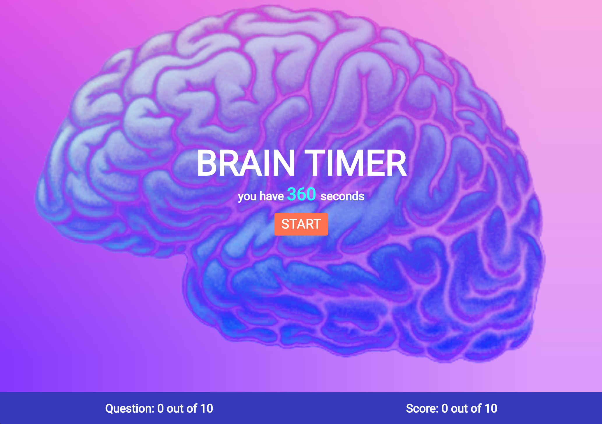
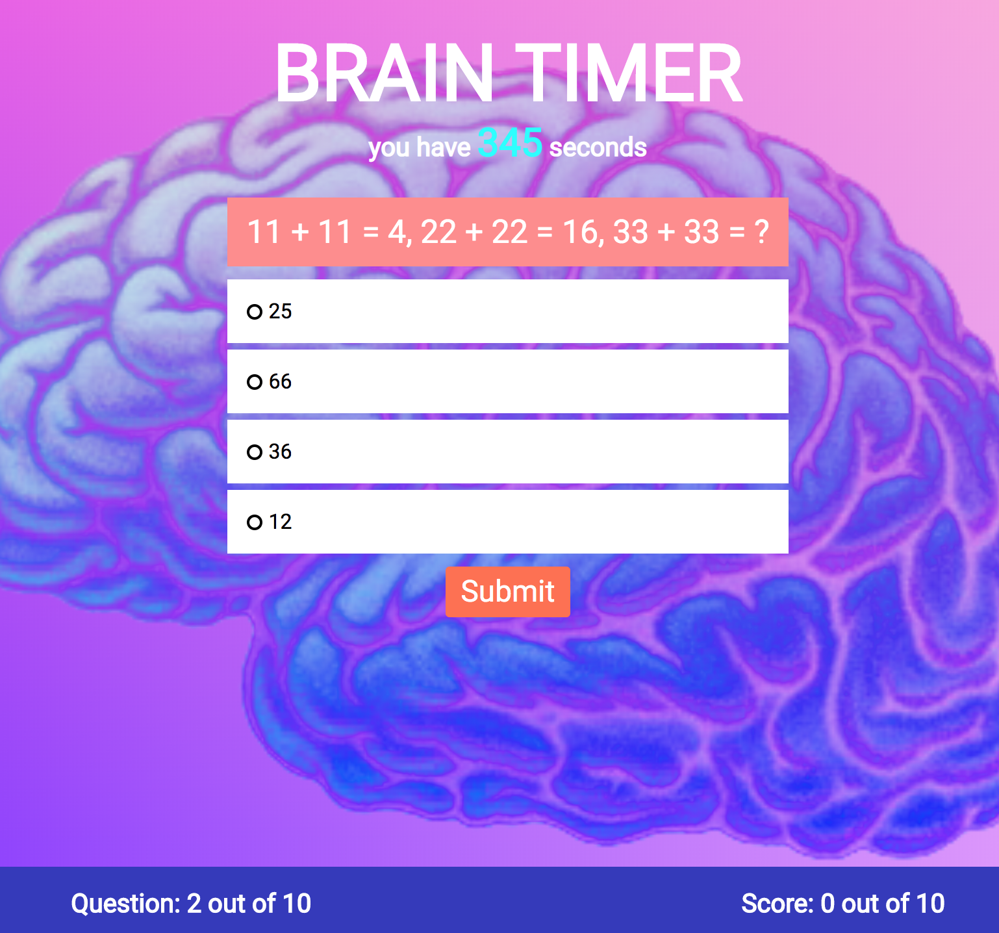
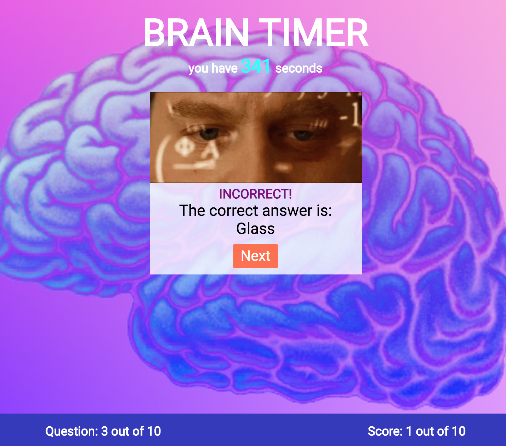

# Brain Timer 

## Link

[https://gbertkim.github.io/BrainTimer/](https://gbertkim.github.io/BrainTimer/)

## Description

Brain Timer is a JavaScript, HTML, and CSS quiz with 10 logic questions and brain teasers. Project was designed for the Thinkful course. There is a timer function that will start and stop as you progress through the quiz. The user must complete all questions before the timer hits "0".

## Snapshots

Here are the snapshots of the app featuring the question/score updates and the timer countdown. 

 